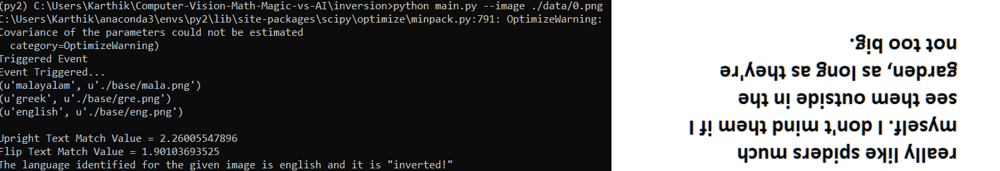
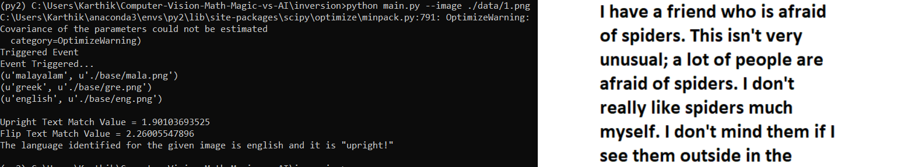

# Multilingual Text Inversion Detection of Scanned Images
## _Text Localization, Image Inversion Detection of Scanned Documents & Language Identification based on Shape Context and CV_


## Problem Definition
There can be problems in textual scanned images. The problem of inversion is one of the hardest anomaly to detect efficiently though it can be easily decipherable visually. Moreover, the scanned document can be in any language and the text can be anywhere in the image. 

In this project, an algorithm to efficiently localize text has been implemented. Once the text area in an image is localized, it is passed on to language identification algorithm. Further, a mathematical descriptor is used to identify the text is inverted or not. The entire pipeline uses traditional methods in place of deep learning based methods and hence much more efficient.


## How to run:
```
docker pull karthik199712/inversion:cv

To execute the pipeline with default image:
sudo docker run -it karthik199712/inversion:cv main.py

To execute the pipeline with an image in the dataset, give the image path and name after --image flag. 

For instance, to execute with 1.png, command is as below:
sudo docker run -it karthik199712/inversion:cv main.py --image ./data/1.png
```

<p align="center">
  
</p> 

<p align="center">
  
</p> 

- Co-working Credits: Karthik K
